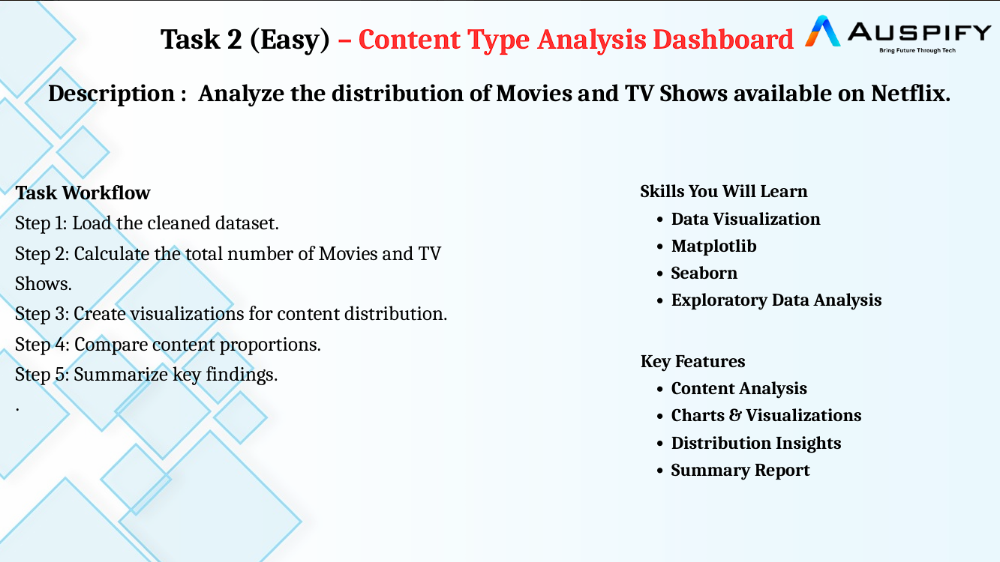
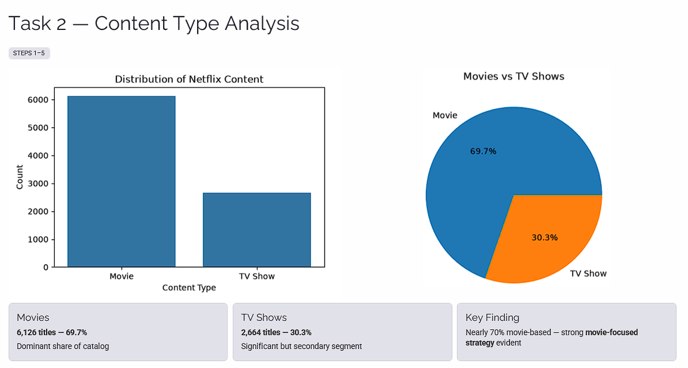
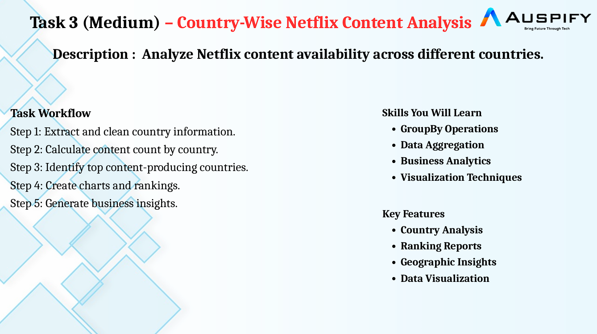
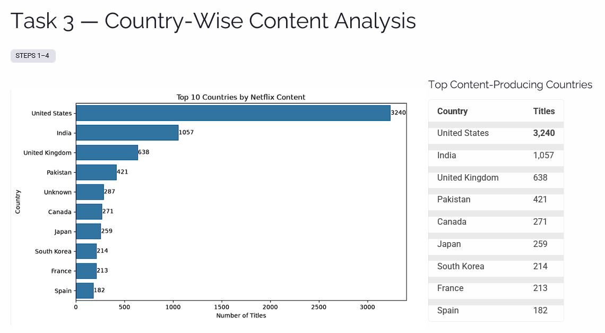
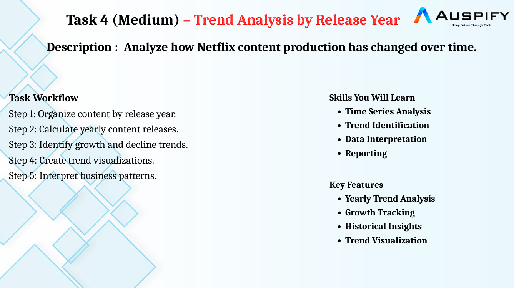
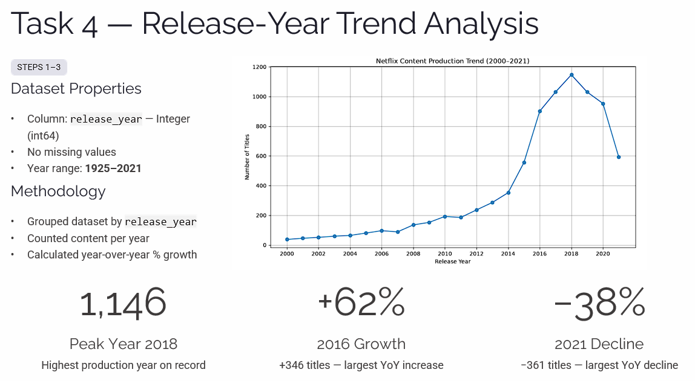

# 🎬 Netflix Data Analysis & Business Insights

> **Raw Data → Clean Data → Analysis → Visualization → Business Insights → Interactive Dashboard**

An end-to-end **Netflix Data Analysis project** built using **Python, Pandas, Matplotlib, Jupyter Notebook and Streamlit**.

The project focuses on **data cleaning, exploratory data analysis, visualization, business insight generation and interactive dashboard development**.

---

## 🚀 Project at a Glance

| Metric | Value |
|---|---:|
| 🎬 Total Titles | **8,790** |
| 🎥 Movies | **6,126** |
| 📺 TV Shows | **2,664** |
| 🌍 Countries | **86** |
| 🧹 Data Cleaning | ✅ Completed |
| 📊 Data Visualization | ✅ Completed |
| 🌐 Streamlit Dashboard | ✅ Completed |

---

## 🎯 Project Objective

The objective of this project is to transform raw Netflix content data into a **clean, reliable and analysis-ready dataset** and generate meaningful business insights from it.

### Key Questions

- 🎬 How many Movies and TV Shows are available?
- 🌍 Which countries contribute the most Netflix content?
- 📈 How has Netflix content production changed over the years?
- 📊 What meaningful patterns can be identified?
- 🌐 How can the analysis be presented through an interactive dashboard?

---

## 🔄 Project Workflow

```text
📁 Raw Netflix Dataset
        ↓
🔍 Data Inspection
        ↓
🧹 Data Cleaning & Preparation
        ↓
📊 Exploratory Data Analysis
        ↓
📈 Visualization
        ↓
💡 Business Insights
        ↓
🌐 Streamlit Dashboard
```

---

# 📂 Dataset

The project uses a Netflix titles dataset containing information about **Movies and TV Shows**.

### Main Columns

| Column | Description |
|---|---|
| `show_id` | Unique identifier for each title |
| `type` | Movie or TV Show |
| `title` | Name of the title |
| `director` | Director information |
| `country` | Country associated with the title |
| `date_added` | Date added to Netflix |
| `release_year` | Original release year |
| `rating` | Content rating |
| `duration` | Movie duration / number of seasons |
| `listed_in` | Genres / categories |

The repository contains both the **raw dataset** and the **cleaned dataset**.

---

# 🧹 Task 1 — Netflix Data Cleaning & Preparation

### 🎯 Objective

Prepare the Netflix dataset for reliable business analysis and reporting.

### 🔧 Work Performed

- Imported the dataset using Python and Pandas
- Inspected dataset structure and data types
- Checked missing values
- Examined categorical columns
- Checked categorical cardinality
- Identified placeholder values such as `Not Given`
- Checked duplicate records
- Investigated categorical inconsistencies
- Validated Country, Rating and Type columns
- Evaluated missing information carefully
- Standardized important categorical columns
- Exported the cleaned dataset

### 🛡️ Data Quality Approach

Missing information was **not blindly replaced**.

Where reliable evidence was unavailable, the missing information was preserved rather than introducing potentially incorrect values.

This approach helps maintain **data integrity and analytical reliability**.

---

# 🎬 Task 2 — Content Type Analysis

### 🎯 Objective

Analyze the distribution of **Movies and TV Shows** available on Netflix.

### 📊 Analysis

The `type` column was used to calculate the total number of Movies and TV Shows.

### 📈 Visualization



### 💡 Key Insight

**Movies represent the majority of Netflix titles**, while TV Shows form a comparatively smaller portion of the dataset.

### 📊 Additional Visualization



---

# 🌍 Task 3 — Country-Wise Netflix Content Analysis

### 🎯 Objective

Analyze Netflix content availability across different countries and identify major content-producing regions.

### 🔧 Analysis Performed

- Examined country information
- Checked country values
- Calculated country-wise content counts
- Ranked countries by content volume
- Identified the Top 10 countries
- Compared Top 10 countries against the remaining countries



### 🏆 Top 10 Content-Producing Countries

### 💡 Key Insight

The **United States** contributes the largest number of titles in the dataset, followed by other major content-producing countries such as **India and the United Kingdom**.

### 📊 Top 10 vs Remaining Countries



### 🔎 Business Perspective

A relatively small group of countries contributes a significant portion of the available Netflix content, indicating a **concentrated content-production footprint**.

---

# 📈 Task 4 — Trend Analysis by Release Year

### 🎯 Objective

Analyze how Netflix content production has changed over time.

### 🔧 Analysis Performed

- Validated the `release_year` column
- Confirmed numerical data type
- Checked the year range
- Grouped titles by release year
- Calculated yearly content counts
- Calculated year-over-year changes
- Identified the highest production year
- Identified major growth and decline periods

### 📈 Netflix Content Production Trend



### 💡 Key Insight

Netflix content production increased significantly during the **2010s**, reaching its highest yearly content count around **2018** in the analyzed dataset.

### 📊 Detailed Trend Analysis



The trend highlights a major expansion of Netflix's content library during the mid-to-late 2010s.

---

# 🌐 Interactive Streamlit Dashboard

The project includes an interactive **Streamlit dashboard** designed to present the most important analytical results in a simple and accessible interface.

### Dashboard Features

- 📊 Dataset Overview
- 🎬 Movie Count
- 📺 TV Show Count
- 🌍 Country Count
- 📈 Content Type Analysis
- 🏆 Top 10 Countries
- 🥧 Country Contribution Analysis
- 📅 Release-Year Trend
- 🔎 Dataset Explorer

### 🔎 Dataset Explorer

Users can select:

```text
X-Axis
   +
Y-Axis
   ↓
Visualization
```

This provides a simple way to explore numerical/date-based relationships within the dataset.

---

# 🖥️ Dashboard Preview


> **Minimal interface. Clear visualizations. Business-focused insights.**

---

# 💡 Key Business Insights

### 🎬 Content Strategy

Movies form the majority of titles in the analyzed Netflix dataset, indicating a stronger representation of movie content compared with TV Shows.

### 🌍 Geographic Distribution

The United States is the largest contributor of Netflix titles, while India and the United Kingdom are also major content-producing markets.

### 📈 Historical Growth

Netflix content production expanded rapidly during the 2010s, with the highest yearly title count occurring around **2018** in the analyzed data.

### 📊 Content Concentration

The Top 10 content-producing countries account for a substantial portion of the overall content, highlighting geographic concentration in Netflix's content library.

---

# 🛠️ Technology Stack

| Technology | Purpose |
|---|---|
| 🐍 Python | Data analysis & processing |
| 🐼 Pandas | Data cleaning & manipulation |
| 🔢 NumPy | Numerical operations |
| 📊 Matplotlib | Data visualization |
| 📓 Jupyter Notebook | Exploratory analysis |
| 🌐 Streamlit | Interactive dashboard |
| 🔧 Git | Version control |
| 🐙 GitHub | Project hosting |

---

# 📁 Project Structure

```text
netflix-data-analysis-dashboard/
│
├── 📄 DATA ANALYSIS USING PYTHON TASK LIST.pdf
├── 📊 Netflix-Data-Analysis-and-Business-Insights.pptx
│
├── 📄 netflix_raw.csv
├── 📄 Netflix_Cleaned_Dataset.csv
│
├── 📓 Task_1_Netflix_Data_Analysis.ipynb
├── 📓 Task_2_&_3_Netflix_Data_Analysis.ipynb
│
├── 🌐 app.py
├── 📄 requirements.txt
├── 📄 README.md
│
├── 🖼️ overview.png
├── 🖼️ task2-content-type-1.png
├── 🖼️ task2-content-type-2.png
├── 🖼️ task3-country-analysis-1.png
├── 🖼️ task3-country-analysis-2.png
├── 🖼️ task4-release-trend-1.png
└── 🖼️ task4-release-trend-2.png
```

---

# 📓 Analysis Notebooks

### Task 1

`Task_1_Netflix_Data_Analysis.ipynb`

Contains:

- Data inspection
- Missing-value analysis
- Duplicate checking
- Categorical analysis
- Data cleaning
- Validation

### Tasks 2 & 3

`Task_2_&_3_Netflix_Data_Analysis.ipynb`

Contains:

- Content type analysis
- Country-wise analysis
- Calculations
- Visualizations
- Business insights

The notebooks keep the analytical workflow **traceable and reproducible**.

---

# 📦 Project Deliverables

This repository contains:

- ✅ Raw Dataset
- ✅ Cleaned Dataset
- ✅ Data Cleaning Notebook
- ✅ Analysis Notebooks
- ✅ Visualizations
- ✅ Streamlit Dashboard
- ✅ Project Presentation
- ✅ Task Requirements PDF
- ✅ Business Insights

---

# ▶️ How to Run the Dashboard

### 1️⃣ Clone the repository

```bash
git clone https://github.com/Khushal-dak/netflix-data-analysis-dashboard.git
```

### 2️⃣ Open the project

```bash
cd netflix-data-analysis-dashboard
```

### 3️⃣ Install dependencies

```bash
pip install -r requirements.txt
```

### 4️⃣ Run Streamlit

```bash
streamlit run app.py
```

The dashboard will open in your browser.

---

# 🎓 Skills Demonstrated

This project demonstrates practical understanding of:

- 🧹 Data Cleaning
- 🔍 Exploratory Data Analysis
- 📊 Data Visualization
- 📈 Trend Analysis
- 🌍 Country-wise Analysis
- 📋 Data Aggregation
- 🛡️ Data Quality Management
- 💡 Business Insight Generation
- 🌐 Interactive Dashboard Development
- 🐙 Git & GitHub

---

# 👨‍💻 Author

## Khushal Dak

**B.Tech — Computer Science Engineering**  
Techno NJR Institute of Technology

🔗 **GitHub:**  
https://github.com/Khushal-dak

---

# ⭐ Final Takeaway

> **Clean Data → Reliable Analysis → Meaningful Insights → Better Decisions**

### 🚀 Netflix Data Analysis

**Raw Data → Cleaning → Analysis → Visualization → Insights → Interactive Dashboard**

---

⭐ If you find this project useful, consider giving the repository a star!
